# CFPB- Consumer Complaints Analytics 
Project on the Consumer Financial Protection Bureau (CFPB) Consumer Complaint Database

---

## 🔎 Executive Summary
**Problem Statement:** The financial services industry has been receiving complaints from consumers regarding various issues such as
fraudulent transactions, poor customer service, and unresponsive companies.
These complaints, collected in the CFPB Consumer Complaint Database, need to be analyzed to identify
patterns and trends that can inform better regulatory decisions and provide companies with actionable insights.
- Problem:
How can we leverage data analytics and machine learning to identify trends and patterns in consumer financial
complaints to improve regulatory oversight and enhance consumer protection?
This problem is significant for policymakers, financial institutions, consumer rights advocates, and consumers
themselves. CFPB regulators can use the analysis to monitor the performance of financial institutions, while
companies can identify areas to improve customer service. The sheer volume of structured and unstructured
data, including the complaint narratives, product categories, and company responses, makes it a task best suited
for data analytics. Machine learning models can help categorize complaints, predict future trends, and provide
actionable insights from both structured and text data.

---

## 📦 Data & Taxonomy
**Data:** I am using the Consumer Complaint Database from the CFPB, which is updated daily and
includes complaints related to various financial products. We are using the data from 01/01/2023 to 10/04/2024.
- Data Attributes:
1. Date CFPB received the complaint (Date)
2. Product/sub-product: The financial product the consumer identified in the complaint (Categorical)
3. Issue/sub-issue: The specific issue the consumer reported (Categorical)
4. State: State of residence of the consumer (Categorical)
5. ZIP code: ZIP code provided by the consumer (Categorical)
6. Company name: Company the complaint is about (Categorical)
7. Timely response: Whether the company provided a timely response (Boolean)
8. Company response: How the company responded to the complaint (Categorical)
9. Public company response: Optional public response from the company (Text)
10. Date complaint sent to company (Date)
11. Consumer consent to publish narrative: Whether the consumer consented to publishing their
narrative (Boolean)
12. Submission method: How the complaint was submitted to CFPB (Categorical)
13. Tags: Additional tags for categorization (Categorical)

- Dataset Statistics:
  - Number of records: ~6 million complaints, but reduced to 3.1 million complaints, because of storage
constraints.
  - Number of features: 13 attributes, but after one-hot-encoding its increased to 455 features.
  - Data source: Consumer Complaint Database (publicly available data.
    
**Targets:**
- **Response Classification:** `timely_response` (binary; yes or no).
- **Sentiment Analysis:** polarity tone over `consumer_complaint_narrative` (e.g., negative/neutral/positive).
- **Time Series:** prediction of monthly complaint counts over the next 6 months.  

---

## 🧪 Notebooks & What They Do
1) **`CFPB_Complaints_EDA.ipynb`**  
   - Load and clean data; sanity checks and missingness.  
   - Distribution plots for *product, issue, state, company*.  
   - Narrative length stats; word clouds.  
   - Calendar views: monthly trend, seasonality, and outliers.
  
   Preprocessing Steps
   Data Cleaning:
    - Since the dataset was pretty large, like approx. 6 million complaints, we had to chunk our data into
      400,000 instances for each chunk. Each chunk (400000, 18) was loaded into the pandas DataFrame and
      then concatenated row-wise.
    - There were 16 categorical columns and 2 numerical features, and these categorical features were
      converted to “category,” and the date features were converted to “date-time.”
    - We calculated the “NaN” values and found out there were 4 features where “NaN” values had more than
      50%. These are subsequently dropped. There were also some features where we had to add a category
      because there were no values at all.

   Visualizations:
    - Yearly complaint count
      
      
      
    - Monthly complaint count

      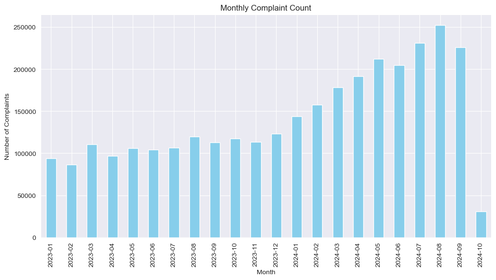

    - Top 10 compalaint by products

      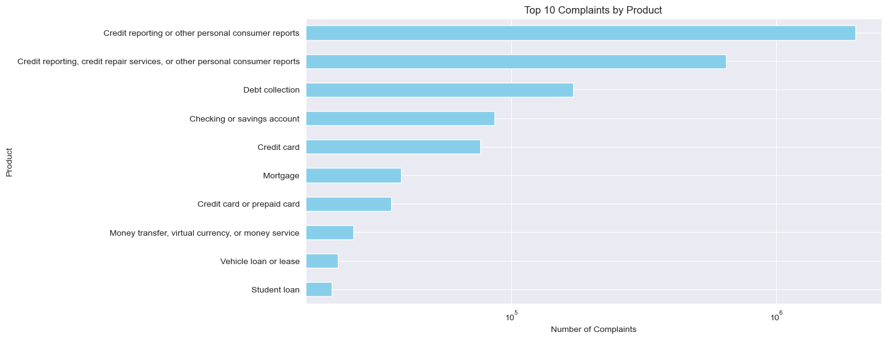

    - Complaints by state 

      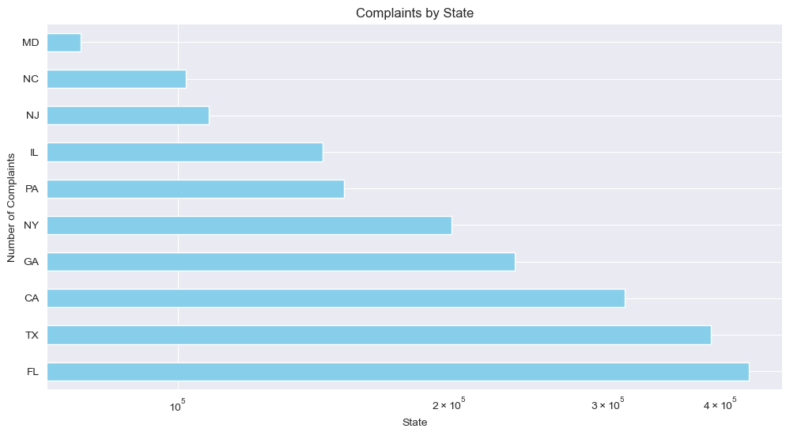

    - Company response
  
      

    - Word Cloud

      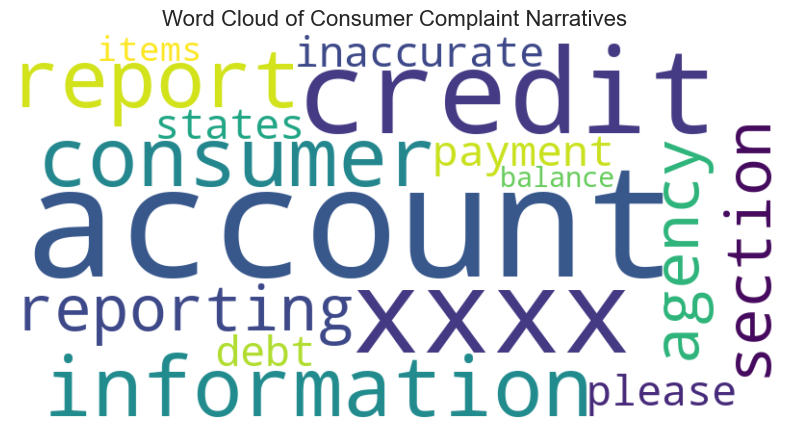

    - Top Complaint by companies (insert pic)
  
      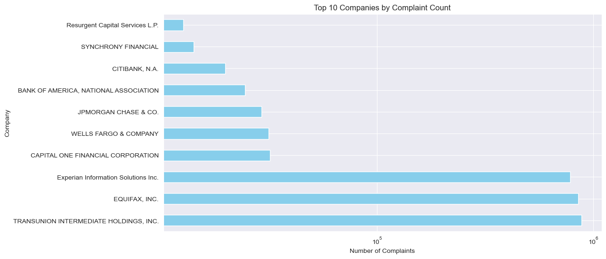

1) **`CFPB_Complaints_Response_Classification.ipynb`**  
   - Text featurization (e.g. One-hot encoding, Standardization of data, data resampling, feature selection)
   - Baselines (XGBoost, 
   - Train/test splits; hyperparameter search using Optuna.  
   - Metrics:Accuracy, Precision/Recall/F1; per-class confusion matrices and classification report.  

    In this section, we analyze the Consumer Financial Protection Bureau (CFPB) complaints data to predict whether
    a financial institution will provide a timely response to a consumer complaint. Our analysis focuses on
    developing a classification model to forecast the likelihood of a timely response, which is crucial for
    understanding and improving customer service in the financial sector. By leveraging various features from the
    complaint data, such as the type of financial product, the company involved, and the nature of the complaint, we
    aim to create a predictive model that can help identify factors influencing response times and potentially assist
    both consumers and financial institutions in managing expectations and improving complaint resolution
    processes.

    **Feature selection** is crucial in analyzing consumer complaints data, addressing challenges like high
    dimensionality and potential overfitting. We reduced 446 columns to 400 features, improving model
    performance and generalization, using `SelectKBest` from `chi_sq` hypothesis
  
    **NearMiss Sampling**:
    It is an undersampling technique used in machine learning to balance imbalanced datasets by removing majority class samples. It works by selecting majority class instances that are closest to the minority class samples, focusing on the boundary region between the two classes to preserve important information for classification. It is initialized with `version=1` and `n_neighbors=3`.
    `Version 1` of NearMiss selects majority class samples that have the smallest average distance to the k-nearest
    minority class samples. Setting `n_neighbors=3` means it considers the 3 nearest neighbors when making its
    selection. This process creates a new, balanced dataset by undersampling the majority class while keeping all
    minority class samples. By balancing the dataset, the subsequent machine learning models are less likely to
    be biased towards the majority class, potentially improving overall predictive performance for the consumer
    complaints analysis.

    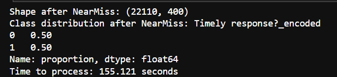

    **Model Selection** (tl;dr):
    - XGBoost: High efficiency and strong performance in classification tasks through gradient boosting with advanced regularization.
    - LightGBM: Fast training speed and memory efficiency with histogram-based learning, ideal for large-scale datasets.
    - Logistic Regression: Simple yet effective linear model providing interpretable probability estimates for binary and multiclass classification.
    - Random Forest: Robust ensemble method combining multiple decision trees to reduce overfitting and improve generalization.
    - Decision Tree: Intuitive tree-based model offering clear interpretability and easy visualization of decision-making rules.
  
    **Performance for each of the model shown in the form of confusion matrix**:
     - XgBoost:
       
      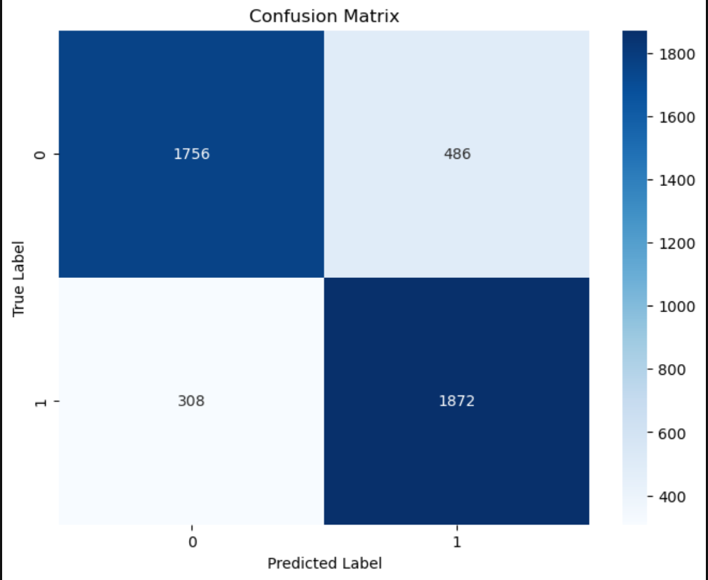

     - LightGBM:
       
      

     - Logistc Regression:
       
      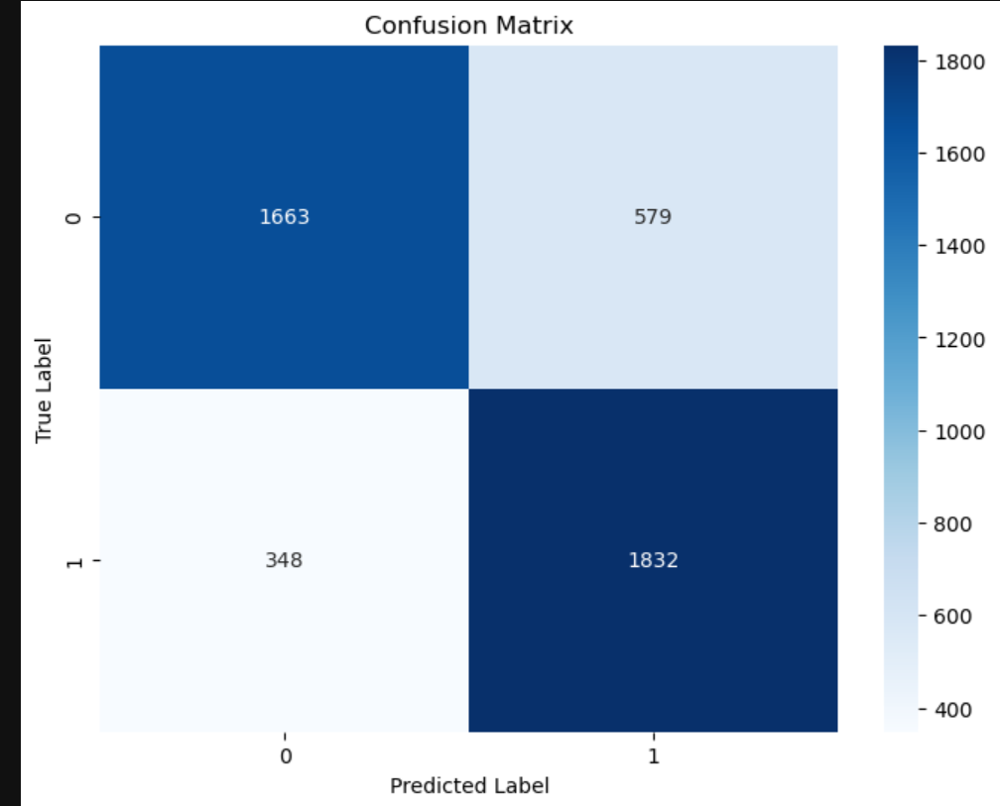

     - Random Forest:
       
      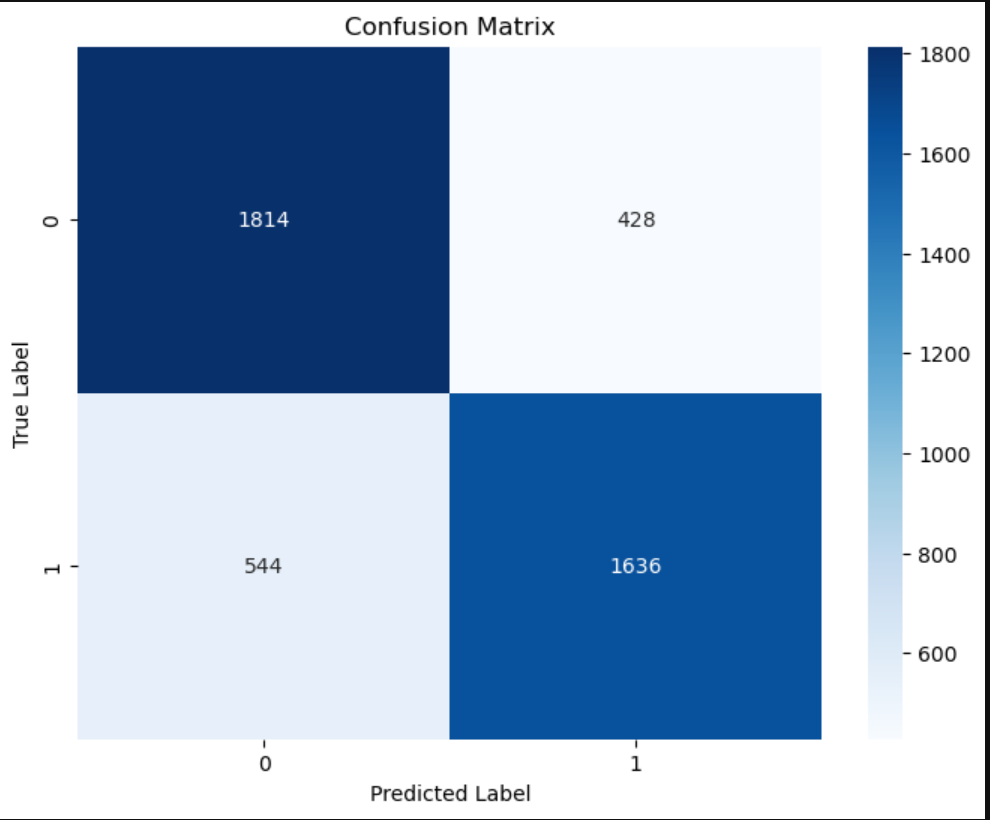

     - Decision Tree:

      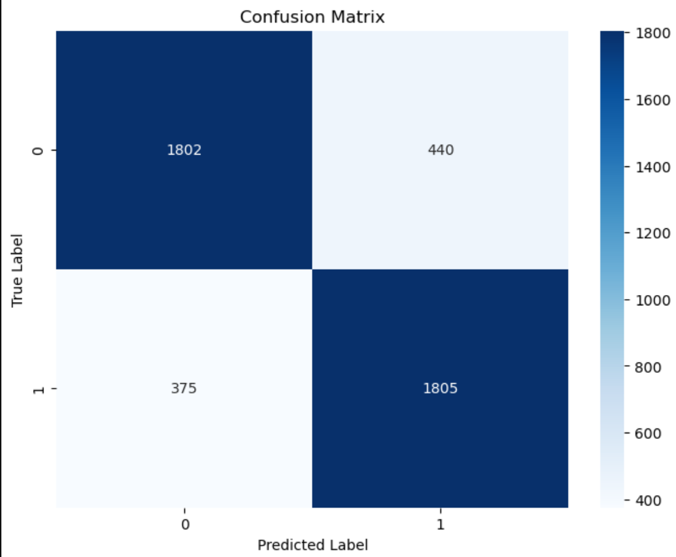

    **Hyper Paramter Tuning**:
     I employed Optuna, an open-source hyperparameter optimization framework, to fine-tune multiple
     machine learning models for the CFPB consumer complaints dataset. This approach automates the search for
     optimal hyperparameters, enhancing model performance and efficiency.

     

     Optimization Process:
     - Define Hyperparameter Search Space: We specified the range of hyperparameters to explore for each model.
     - Create Optuna Study with TPE Sampler:Optuna initializes a study object using the TPE sampler, which employs Bayesian optimization to model the relationship between hyperparameters and model performance. Unlike random or grid              search, TPE learns from past trials to focus computational resources on promising hyperparameter regions.
     - Iterative Trial Process: The optimization follows an adaptive cycle:
          a. Suggest Hyperparameters (Trial n): Optuna's TPE sampler proposes a new set of hyperparameters, Early trials explore the space broadly, Later trials exploit promising regions based on previous results

          b. Train Model with Suggested Parameters: The model is trained using the suggested hyperparameter configuration, Training is performed on the training dataset with cross-validation

          c. Evaluate Performance: The trained model is evaluated on the validation set, Common metrics used: Accuracy, F1-Score, ROC-AUC, Precision-Recall, The performance metric is reported back to Optuna

          d. Update Knowledge: Optuna updates its internal probabilistic model, The TPE algorithm adjusts its understanding of which hyperparameter regions yield better performance, This informs the next trial's hyperparameter suggestions

     - Convergence Check: After each trial, Optuna checks if the maximum number of trials has been reached (typically 50-200 trials). If not, the process loops back to suggest new hyperparameters. If yes, optimization concludes.
     - Return Best Hyperparameters: Upon completion, Optuna returns:
          a. The best hyperparameter configuration found
          b. The corresponding performance score
          c. Complete trial history for analysis
     
    
3) **`CFPB_Complaints_Sentiment_Analysis.ipynb`**  
   - ML-based sentiment on `consumer_complaint_narrative` using FinBERT.    
   - Visualize **sentiment drift** across sentiments.

    In this section of the report, sentiment analysis is conducted on a dataset of consumer complaints to uncover
    patterns and themes in the textual narratives. The analysis begins with preprocessing steps like handling missing
    values and analyzing the distribution of text lengths. Word frequency analysis and visualizations such as word
    clouds and bar charts are employed to highlight recurring terms, followed by sentiment classification using
    FinBERT, a model fine-tuned for financial text, ensuring robust handling of domain-specific language. These
    insights provide a foundation for addressing consumer concerns and enhancing customer service strategies.

   

    **Word Cloud Analysis**:
    The word cloud serves as an effective exploratory tool, providing a quick overview of key concerns and topics
    within the complaints. By highlighting common terms, it underscores the focus on financial and
    consumer-related matters, such as inaccurate information, payments, and balances. This visualization
    complements detailed quantitative analyses by offering a more accessible summary, making it easier to identify
    central themes that could inform targeted interventions or improvements in services. Despite the presence of
    anonymized data like "xxxx," the word cloud demonstrates that meaningful insights about consumer concerns
    can still be extracted, showcasing the robustness of the preprocessing and sentiment analysis workflow.

    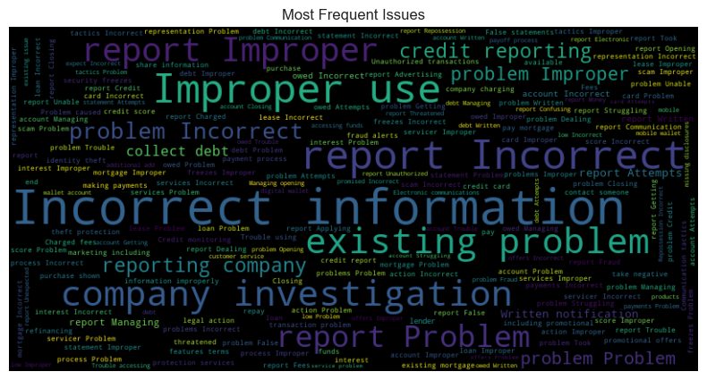

   **Model Implementation**:
    The sentiment analysis was performed using FinBERT, a financial text-specific model, integrated into a Hugging
    Face pipeline. This setup employs BertForSequenceClassification and BertTokenizer to categorize text into
    positive, neutral, or negative sentiments. The process is optimized for large datasets through batch processing,
    analyzing 32 records at a time. To accommodate FinBERT's 512-token limit, text is truncated, balancing
    efficiency with information preservation.

    **Results**:
    The results indicate a heavy skew toward neutral sentiment, with 733,952 entries classified as neutral, followed
    by 212,383 as negative, and 5,349 as positive. This distribution aligns with the nature of consumer complaints,
    which often contain descriptive language rather than overtly emotional tones.

    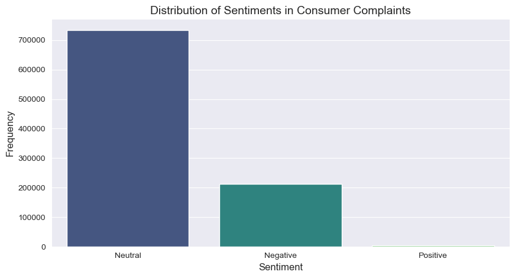

    **Word Clouds for each Sentiment**:
     - Negative: The word cloud for narratives with negative sentiment highlights the most frequently used words in complaints
      classified as negative. Key terms like "credit," "account," "report," and "consumer" dominate the visualization,
      reflecting the dataset's primary focus on financial issues. Words such as "fraudulent," "late," "inaccurate," and
      "payment" suggest that common grievances relate to delayed or incorrect reporting, fraudulent activities, and
      payment disputes. The placeholder "xxxx" also appears prominently, as it represents anonymized consumer data.
      Its presence further emphasizes the prevalence of personally identifiable information being masked in
      complaints, but it does not diminish the utility of the text for sentiment analysis. 

      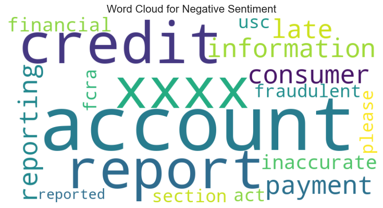

    - Positive: The positive sentiment word cloud emphasizes key terms like "credit," "account," "payment," and "consumer,"
      reflecting primary themes in financial management and transactions. Interestingly, words such as "believe,"
      "please," and "take" suggest courteous language, potentially indicating customer satisfaction or appreciation in
      dispute resolution or successful transactions. "Report" and "information" also feature prominently, hinting at
      positive feedback related to clear reporting or accurate information provision. The frequent appearance of "xxxx"
      likely represents redacted sensitive data, maintaining its presence even in positive narratives. This visualization
      demonstrates that while positive feedback is less common in the dataset, it still centers around similar financial
      themes as other sentiment categories.

      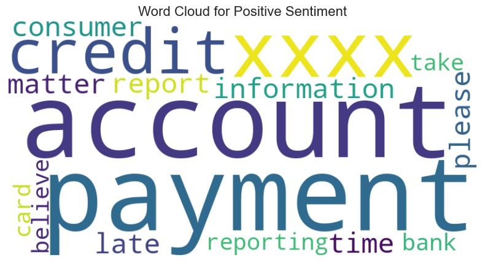

    - Neutral: The neutral sentiment word cloud highlights terms such as "credit," "account," "report," and "information,"
      suggesting that these narratives often focus on factual or technical matters rather than emotional responses.
      Words like "agency," "items," "states," and "section" indicate that neutral feedback frequently involves
      regulatory, procedural, or informational aspects. These narratives likely pertain to account details, reporting
      processes, or interactions with financial institutions. The recurring presence of "xxxx" points to the masking of
      sensitive information in these descriptive or procedural contexts.

      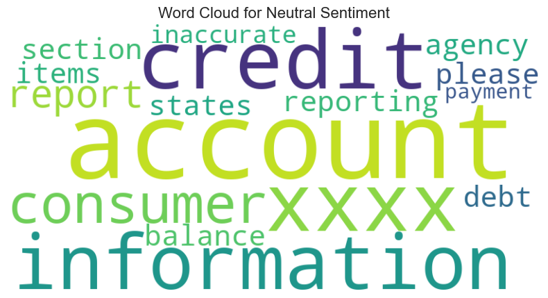

5) **`CFPB_Complaints_Time_Series_Forecasting.ipynb`**  
   - Aggregate to monthly counts; handle reporting lags and missing months.  
   - Benchmarks: naïve seasonal, moving averages; models: SARIMA/Prophet (pick one or both).  
   - Backtests with expanding or rolling windows; prediction intervals.  
   - Scenario views: overall, by product, and top states/companies.
  
   In this section, we analyze the Consumer Financial Protection Bureau (CFPB) complaints data to explore
   time-series patterns, verify data completeness, and prepare it for future forecasting models. The process involves
   several steps, including verifying the dataset's temporal coverage, identifying missing dates, creating a time
   series, visualizing trends and seasonality, assessing stationarity, and analyzing autocorrelation and outliers, and
   creating 3 time-series forecasting models: ARIMA, Prophet, and GPU-based LSTM.

   **Model Selection:** (No ground truth - so residual plot should show data in a normal distribution aka bell curve)
   - ARIMA: The ARIMA model is a powerful tool for time-series
    forecasting, as it combines autoregressive (AR) terms, differencing (I) to make the data stationary, and moving
    average (MA) terms to model residuals.

     - Baseline Reults:
       - The initial ARIMA model was fit with parameters p = 1, d = 1, and q = 1. The results indicate a significant
       - Relationship among the AR, MA terms, and residual variance:
          - AR(1) Coefficient: -0.4567 (statistically significant with p < 0.05).
          - MA(1) Coefficient: 0.8164 (statistically significant with p < 0.05).
          - Sigma^2 (residual variance): 2.887×10^6.

      

      Fine-Tune: To improve the initial model, a grid search was conducted over the ranges of p ∈ [0,4], d ∈ [0,1], and q ∈
      [0,4]. The best parameters identified were p = 4, d = 1, and q = 3, with an AIC of 10473.52—a significant
      improvement over the initial model. The fine-tuned ARIMA(4, 1, 3) model provided the following:
   
      Coefficients for AR(1) through AR(4) and MA(1) through MA(3) were all statistically significant (p < 0.05).
      Residual variance (sigma^2): 1.053×10^6, suggesting improved model performance.

      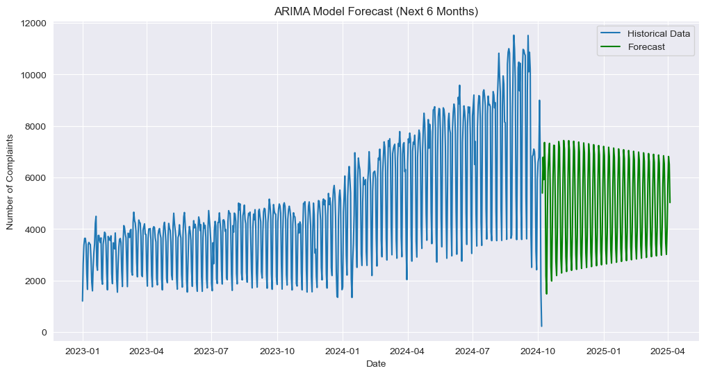

      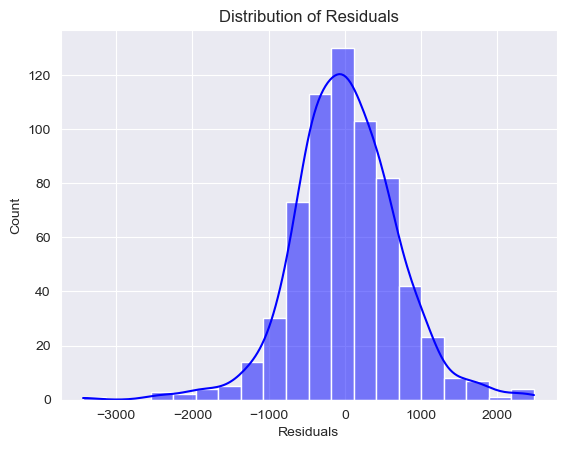

    - Prophet: It is a robust, open-source forecasting tool designed to handle seasonality and trends
      effectively. The data was preprocessed into the required format with columns ds (date) and y (complaints). The
      model captured the historical patterns and extended the forecast into the future while accounting for
      uncertainties, represented by confidence intervals.

      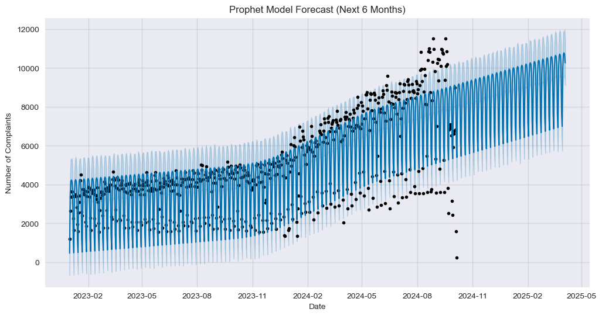

      Fine-Tune: The fine-tuned model further adjusts the parameters such as changepoint_prior_scale and seasonality_prior_scale
      to enhance accuracy. The fine-tuned forecast graph shows a more refined forecast with narrower confidence
      intervals, indicating reduced uncertainties. Additionally, seasonalities are better captured, highlighting a
      significant periodicity in complaint counts.

      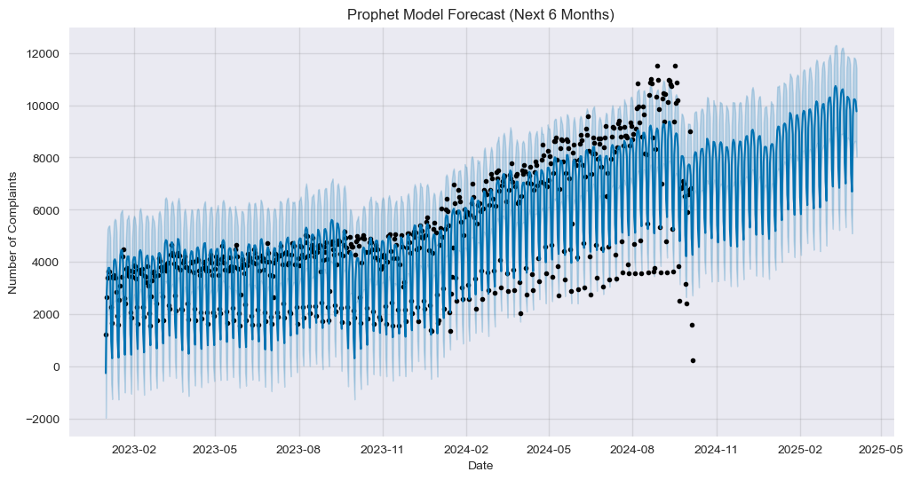

      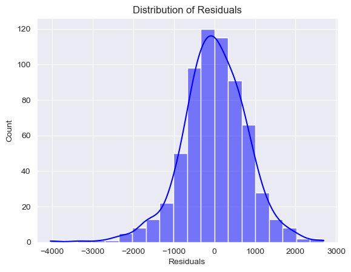

    - LSTM: The LSTM model, known for its ability to capture temporal dependencies, was applied to the
      time-series data with baseline and fine-tuned configurations. Below, we provide an in-depth explanation of the
      visualizations generated, detailing the model's outputs, the patterns it captured, and the residual analysis.

      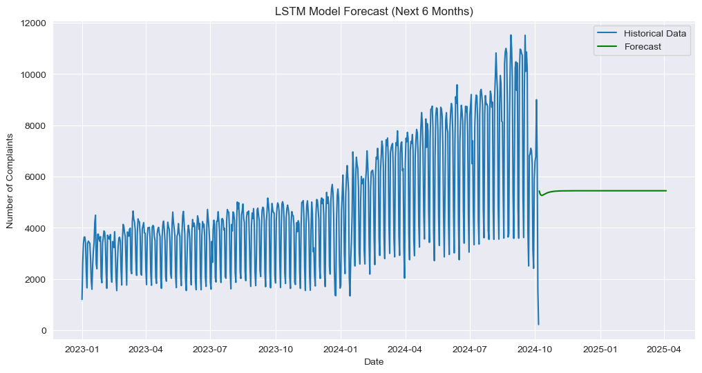

      Fine-Tune: The baseline LSTM model was fine tuned using Grid search. The parameters that were tuned were `{'epochs', 'hidden_size', 'learning_rate', 'num_layers': 1}`.

      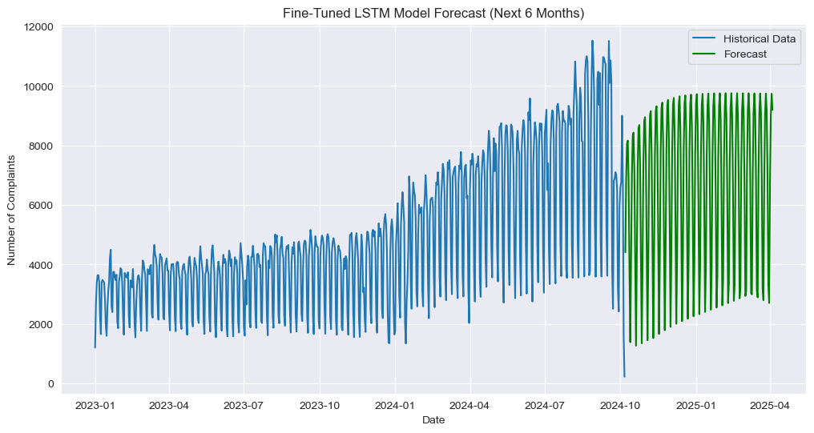

      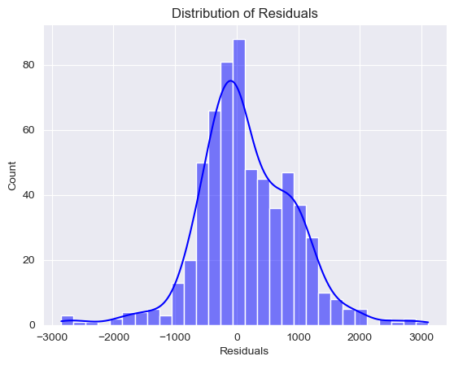

## 📊 Evaluation
**Classification:** Accuracy, precison, recall, f1-score (all metrics based on confusion matrix).
**Sentiment:** sentiment of the complaint (positive/negative/neutral).
**Forecasting:** coverage of prediction on 6 month interval - baseline and fine tuned, with moajor aprt of evaulation to see whther the distribution is normal distribution.

---

### Typical flows
- **EDA:** run sections top-to-bottom to profile data health and distributions.  
- **Response Classification:** edit the *label set* and TF–IDF parameters; run training, then evaluate on a held-out set.  
- **Sentiment:** choose VADER or a model-based approach; compare across cohorts and time.  
- **Forecasting:** pick aggregation level (overall/product/state), run model fit + backtests, export future-month forecasts.
